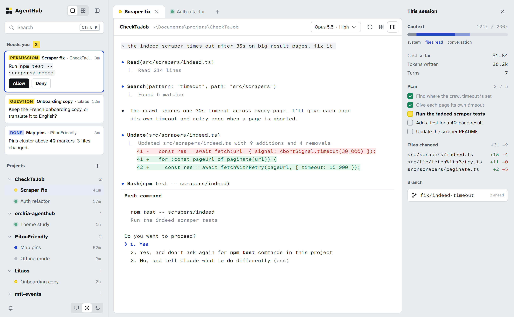
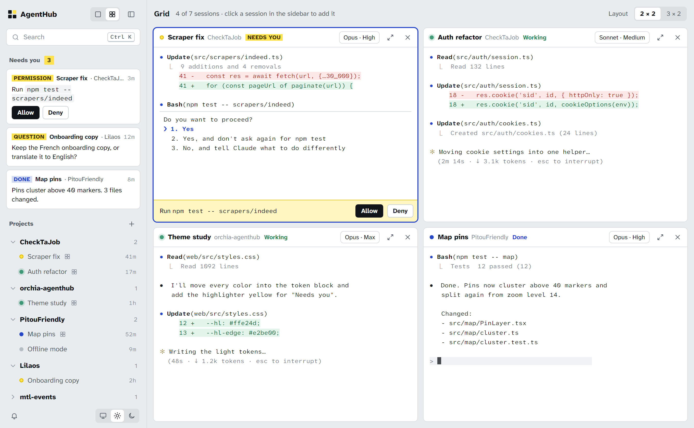
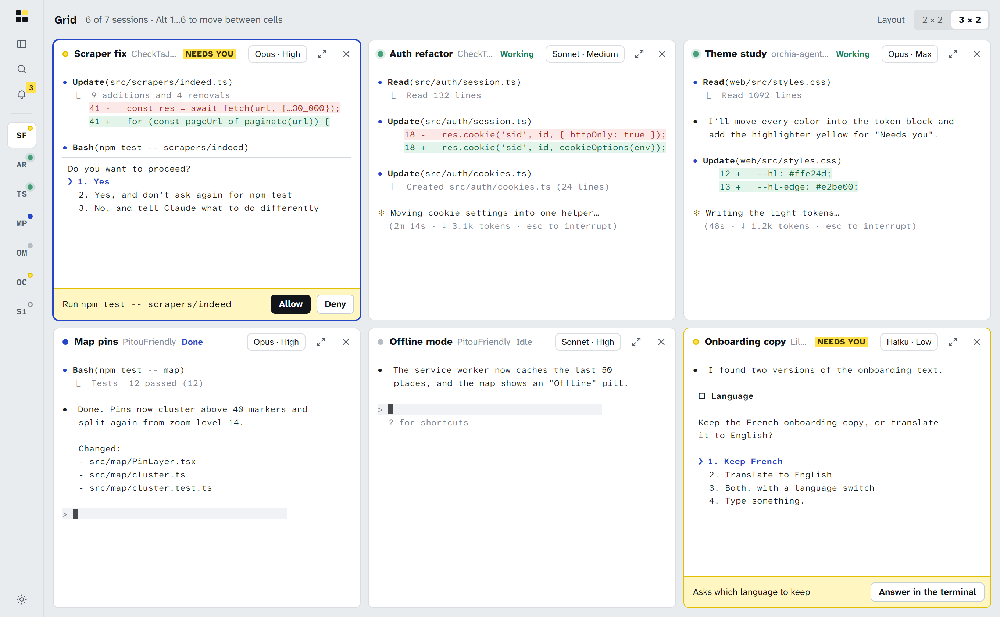
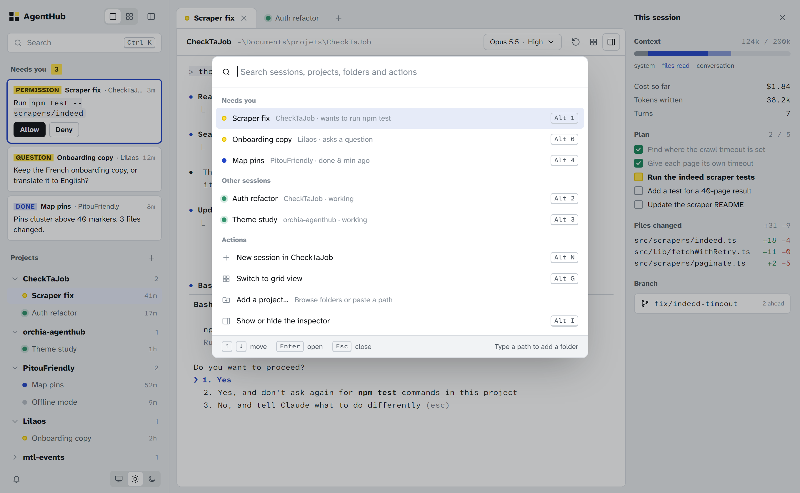
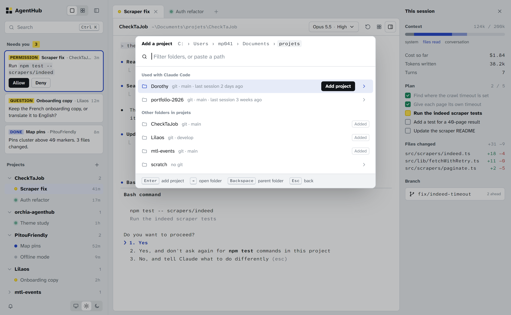
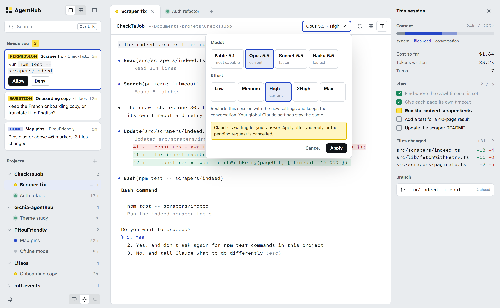
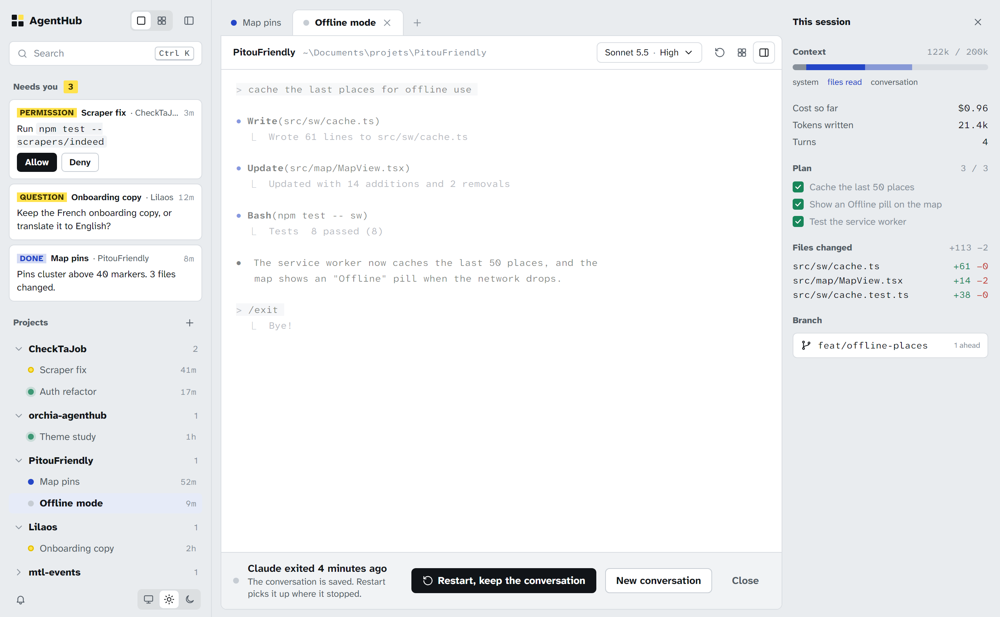
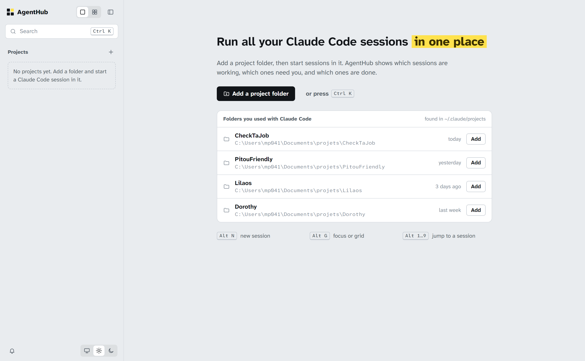

# AgentHub

One dashboard for all your Claude Code sessions, organized by project.

<picture>
  <source media="(prefers-color-scheme: dark)" srcset="docs/design/focus-dark.png">
  
</picture>

> [!NOTE]
> These screenshots are mockups of the **Établi** theme. One thing in them is not
> built yet: answering permissions from the inbox or the grid.

## A look around

<table>
  <tr>
    <td width="50%">
      <picture>
        <source media="(prefers-color-scheme: dark)" srcset="docs/design/grid4-dark.png">
        
      </picture>
      <p><b>Grid, 2 × 2.</b> Every session shows its state in words. Allow or deny a request without leaving the grid.</p>
    </td>
    <td width="50%">
      <picture>
        <source media="(prefers-color-scheme: dark)" srcset="docs/design/grid6-dark.png">
        
      </picture>
      <p><b>Grid, 3 × 2.</b> The sidebar folds into a rail and keeps the count of sessions that need you.</p>
    </td>
  </tr>
  <tr>
    <td>
      <picture>
        <source media="(prefers-color-scheme: dark)" srcset="docs/design/palette-dark.png">
        
      </picture>
      <p><b>Search, <kbd>Ctrl K</kbd>.</b> Sessions that need you come first. Every action shows its shortcut.</p>
    </td>
    <td>
      <picture>
        <source media="(prefers-color-scheme: dark)" srcset="docs/design/add-dark.png">
        
      </picture>
      <p><b>Add a project.</b> Folders you already used with Claude Code are listed first.</p>
    </td>
  </tr>
  <tr>
    <td>
      <picture>
        <source media="(prefers-color-scheme: dark)" srcset="docs/design/model-dark.png">
        
      </picture>
      <p><b>Model and effort.</b> Changed per session. The conversation is kept.</p>
    </td>
    <td>
      <picture>
        <source media="(prefers-color-scheme: dark)" srcset="docs/design/ended-dark.png">
        
      </picture>
      <p><b>Session ended.</b> Restart and pick the conversation up where it stopped.</p>
    </td>
  </tr>
  <tr>
    <td colspan="2">
      <picture>
        <source media="(prefers-color-scheme: dark)" srcset="docs/design/welcome-dark.png">
        
      </picture>
      <p><b>First launch.</b> Add a project in one click from the folders Claude Code already knows.</p>
    </td>
  </tr>
</table>

The screenshots come from [docs/design/mockups.html](docs/design/mockups.html). Open it
in a browser to page through the screens, or add `#grid4-dark` (any screen id and
`light` or `dark`) to the URL to render one screen at full size.

## Run

```sh
npm install
npm start        # builds the UI, serves everything on http://127.0.0.1:4317
npm run dev      # development: UI with hot reload on http://localhost:5173
```

Reloading the page reattaches to running sessions. Projects are saved in
`~/.agenthub/config.json` and sessions in `~/.agenthub/sessions.json`.

When the server stops (restart, closed terminal, reboot, crash), sessions come
back **paused** and resume their Claude conversation (`claude --resume`) as soon
as they are shown. A turn that was running at that moment is interrupted. The
restart button keeps the conversation; "New conversation" starts a fresh one.

## Shortcuts

| Keys          | Action                                 |
| ------------- | -------------------------------------- |
| `Ctrl K`      | Search projects, folders and actions   |
| `Alt N`       | New session in the current project     |
| `Alt G`       | Switch between focus and grid view     |
| `Alt I`       | Show or hide the inspector (focus view) |
| `Alt 1` … `9` | Jump to a session (sidebar order)      |
| `Shift Enter` | New line in Claude's prompt            |
| `Ctrl C`      | Copy when text is selected, else interrupt |

Double-click a session in the sidebar to rename it. In grid view, clicking a
session in the sidebar adds it to the grid (up to 6); double-click a cell header
to focus it. `Alt 1…9` uses the physical number keys, so it works on AZERTY too.

## Session status

Sessions started from AgentHub report what they are doing through Claude Code
HTTP hooks, injected with `--settings ~/.agenthub/claude-hooks.json`. They are
added next to your own hooks, never replacing them, and only for these sessions.

| Dot          | Meaning                                              |
| ------------ | ---------------------------------------------------- |
| green, pulse | Working                                              |
| amber        | Needs you: permission, question or plan to review    |
| blue         | Done, not looked at yet                              |
| gray         | Idle                                                 |
| hollow       | Paused after a server restart, resumes when shown    |
| dim          | Process ended                                        |

Amber and blue sessions are listed under **Needs you** and counted in the tab
title. The bell in the sidebar turns on desktop notifications, sent only while
the tab is in the background.

## Model and effort

The chip next to the session name shows the model that last answered (read from
the transcript and the `PostModelSwitch` hook) and the effort chosen in AgentHub.
Changing them relaunches that session with `--resume --model … --effort …`: the
conversation is kept and your global Claude settings are not touched (unlike
typing `/model`, which saves a new default). An `/effort` typed inside Claude is
not reflected in the chip.

## Inspector

The panel on the right of the focus view (`Alt I`) shows, for the session on
screen:

- **Context** used and **cost so far**, as Claude Code itself estimates them. Claude
  Code only gives these to its status line, so the injected settings also set a
  status line command, `server/statusline.mjs`, which passes them to AgentHub and
  then runs your own status line (from your user or project settings) unchanged.
  Side effect: with any status line set, Claude Code hides some footer hints such
  as "esc to interrupt".
- **Plan**, when Claude keeps one with its task tools (`TaskCreate`/`TaskUpdate`,
  or `TodoWrite`). Recent models don't use them by default, so it is often absent.
- **Uncommitted changes** and **branch** of the project folder, from `git status`
  and `git diff HEAD`. Every session in the same folder sees the same changes.

## Environment

| Variable          | Default        | Purpose                         |
| ----------------- | -------------- | ------------------------------- |
| `AGENTHUB_PORT`   | `4317`         | Server port                     |
| `AGENTHUB_HOME`   | `~/.agenthub`  | Where projects are saved        |
| `AGENTHUB_CLAUDE` | `claude`       | Command used to start Claude    |
